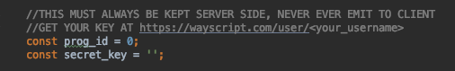

# WayScript JS to Gmail Example

This example uses JavaScript and the <a href="https://github.com/wayscript/wayscript-js">wayscript-js</a> library to submit an email, subject, and message body to a WayScript program on a button click. 
WayScript then sends the message using Gmail.

## View Web Page

To view the web page, simply navigate to the `index.html` file in your browser.

## Setup Your WayScript Program

1) If you don't have one already, register for a WayScript account at https://wayscript.com.

2) Create a New Program 
    

3) Add a Webhook Trigger 
     
    - In the Outputs section of the Trigger Module, create a Variable Called 'Email' and give it a default value (i.e. test@example.com )
    - In the Outputs section of the Trigger Module, create a Variable Called 'Subject' and give it a default value (i.e. Dinner Tuesday? )
    - In the Outputs section of the Trigger Module, create a Variable Called 'Body' and give it a default value (i.e. Want to grab a bite Tuesday night? )
    - Take note of your Program ID and API Key  
    

4) Drag in the Gmail Module as your next step 
    

5) Setup your Gmail module
    - Select your Gmail account
    - Choose "Send Email" under "What would you like to do?"
    - Under Inputs:
        - Select the "Email" variable in the "To" field
        - Select the "Subject" variable in the "Subject" field
        - In the "Email Body" field, type "[Body]" to print the text of your body variable.

    

## Run App

1) Open the `js/main.js` file and input your Program ID and API Key (shown in the Webhook Trigger) into the file.

    

2) Refresh the site page (`index.html`).

3) Press the "Send"  button and the WayScript program sends your message using Gmail!

   
